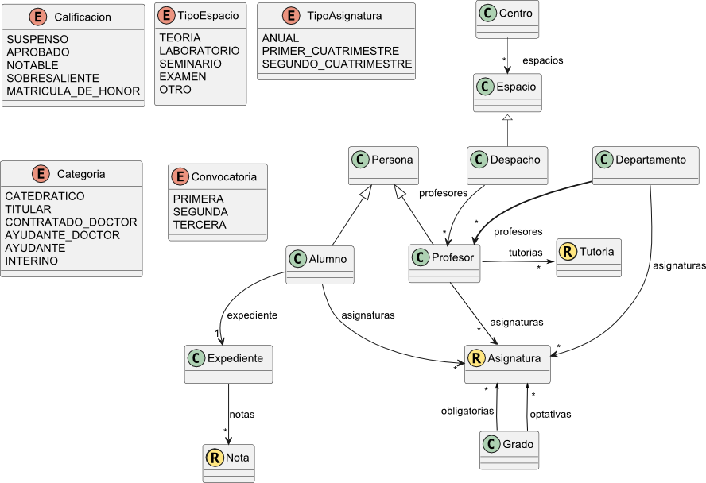

## Fundamentos de Programación
# Proyecto de laboratorio: Gestión Grados Universitarios.

**Autores:** Toñi Reina

**Revisores:**

Se desea desarrollar una aplicación para la gestión de grados universitarios. Esta aplicación permitirá a la secretaría de los centros realizar distintos procedimientos y gestiones que incumben a los alumnos, los profesores y las asignaturas impartidas, entre otros. Aunque no llegaremos a desarrollar la aplicación completa, sí llevaremos a cabo la implementación de distintos tipos y operaciones sobre los que se asentaría la misma. La aplicación consta de una serie de entidades relacionadas entre sí, que se muestran en la Figura 1.

Estas entidades se irán definiendo poco a poco a lo largo varios laboratorios, y de manera incremental conforme vayamos avanzando en los conocimientos de la asignatura. Los conceptos que representan cada una de las entidades son los siguientes:

- **Alumno**: alumno matriculado en la Universidad.
- **Asignatura**: asignatura impartida en un grado.
- **Centro**: centro docente de la Universidad.
- **Departamento**: unidad docente de la Universidad formada por profesores. 
- **Despacho**: espacio ocupado por uno o más profesores.
- **Espacio**: espacio físico de un centro destinado a tareas docentes.
- **Expediente**: expediente académico de un alumno, formado por todas sus notas.
- **Grado**: titulación impartida por la Universidad.
- **Nota**: calificación obtenida por un alumno en una asignatura y convocatoria dadas.
- **Persona**: cualquier miembro de la comunidad universitaria.
- **Profesor**: profesor de la Universidad.
- **Tutoría**: tiempo reservado por un profesor para atender a sus alumnos.

### **Parte I**

En esta primera parte diseñaremos tipos base que se implemetarán como clases o como records y los correspondientes enumerados para darle soporte. La descripción de los ejercicios de este bloque se encuentra en el archivo [PARTE-01.md](./PARTE-01.md)

### **Parte II**

En esta segunda parte enriqueceremos los tipos implementados en la Parte I con restricciones, criterios de igualdad y orden, e implementaremos nuestros primeros tipos contenedores. La descripción de los ejercicios de este bloque se encuentra en el archivo [PARTE-02.md](./PARTE-02.md). Use la clase [Checkers](./Checkers.java) que se le proporciona para implementar las restricciones.
